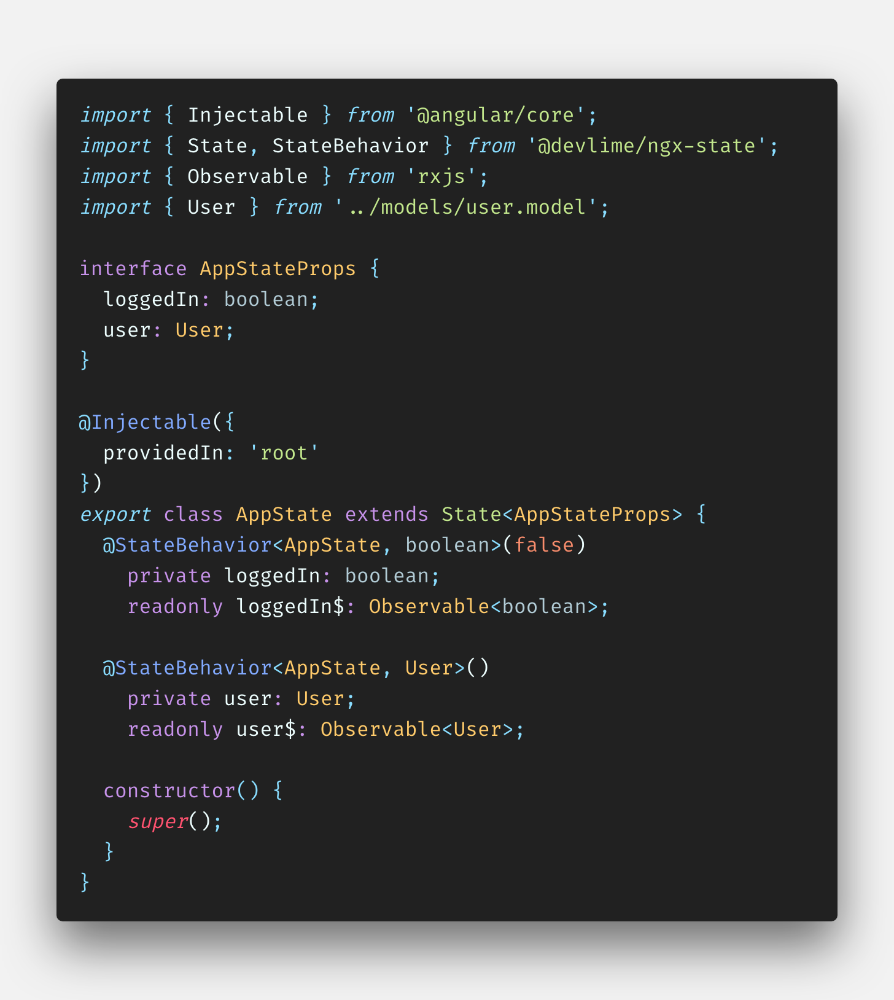
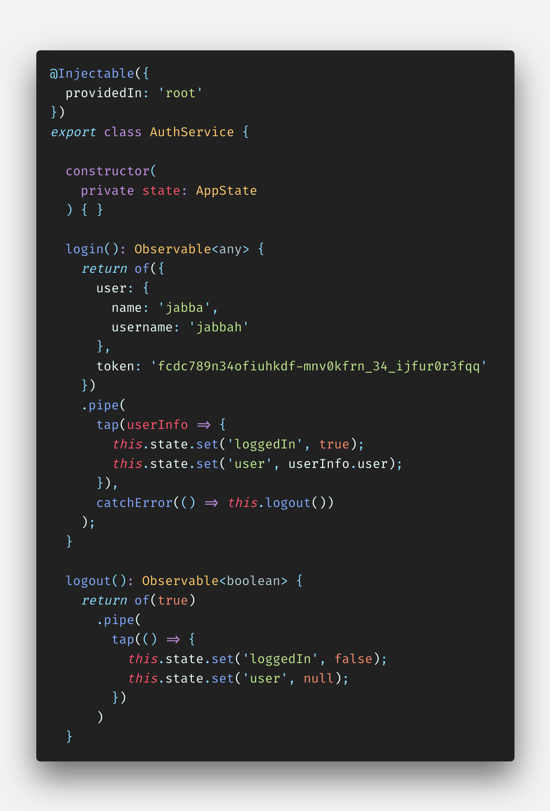

<h1 align="center">@devlime/ngx-state</h1>

Simple State Management Utilities for Angular Apps

  
  
  
  
  

- Demo - Coming Soon!
- [Setup](#setup)
- [Usage](#usage)
- [schematics](#schematics)
- [inspiration](#inspiration)
- [License](#license)

## Let's make state easy
**@devlime/ngx-state** was created to simplify state management in Angular applications. We do not consider it a "framework" but rather a bag of utilities to help make the world a better place by making performant state management **EASY** in Angular without the need to learn YET ANOTHER FRAMEWORK or REDUX! @devlime/ngx-state provides a **VERY SIMPLE** type-safe state class to extend from, a handful of decorators to help make your life more enjoyable while keeping state CLEAN & READABLE, and a `*subscribe` directive so you aren't `*ngIf`ing your life away

## Setup
`yarn add @devlime/ngx-state` *if you wanna be hip*

or

`npm install @devlime/ngx-state --save` *if your neck has a beard*

## Usage
Bear with us... We promise next time you check this it will be filled in

### State
The `State` *"service"* class is a base class to extend your state(s) from. It takes in an interface and provides a type-safe set function. It is recommended that your States be used only to store your state data and that's it.
#### State Usage Example:

#### State `set` Usage Example:

### Decorators
The decorators in @devlime/ngx-state were created to make your life easy by keeping states clean and readable. Behind the scenes the property decorators leverage `Object.defineProperty` to create both hidden private, and public properties with setters and getters that provide immutability and indirect access to your state data.

#### @StateProp (it's just a variable yall)
> ##### Type Parameters
> T: extends State,
> P: value type
> ##### Parameters
> defaultValue: P = null

#### @StateBehavior (it's just a BehaviorSubject yall)
> ##### Type Parameters
> T: extends State,
> P: BehaviorSubject value type
> ##### Parameters
> defaultValue: P = null

#### @StateReplay (it's just a ReplaySubject yall)
> ##### Type Parameters
> T: extends State,
> P: ReplaySubject value type
> ##### Parameters
> replaylength: number = 1

#### @StateSubject (it's just a Subject yall)
> ##### Type Parameters
> T: extends State,
> P: value type
> ##### Parameters
> N/A

## Schematics
Angular schematics for @devlime/ngx-state are already underway! Update coming soon!

## Inspiration
Project inspired by Angular and how awesome it is when used properly (with great power comes great responsibility). 

## Contact
Created by [John Pribesh](mailto:john@devlimelabs.com) for Devlime Labs

## License
@devlime/ngx-state is released under the
[MIT license](https://opensource.org/licenses/MIT) for you to enjoy, abuse, or fall in love and have 3 kids with. This is our gift to you and what you do with it is your call!
